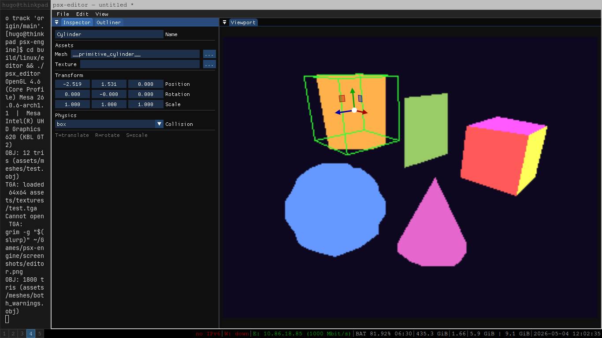

# psx-engine

A C++ PSX-aesthetic 3D engine with its own level editor — built as an experiment in the Claude Code workflow.


## What this is

Two cross-platform C++ executables sharing a renderer:

- **`psx_engine`** — runtime, loads `.pscene` files, renders with the PSX aesthetic
- **`psx_editor`** — Blender-inspired level editor for non-coders to build scenes

The PSX look comes from honest emulation of the original hardware constraints:
vertex snapping (the wobble), affine texture warping (the swim), 320×240 internal
framebuffer upscaled with nearest-neighbour, and a limited geometry budget (The OBJ loader is reflective of this philosophy).


## Aesthetic features

- **Vertex snap** — screen-space coordinate quantisation in the vertex shader
- **Affine UV warp** — perspective-incorrect texture interpolation, the classic PSX swim
- **320×240 FBO** with `GL_NEAREST` upscale — pixelated, low-res rendering
- **Texture × vertex colour** blend — authentic PSX tinting
- Geometry budget validation — warns when meshes exceed PSX-era polygon counts



## Editor features

- ImGui dockable panels: viewport, outliner, inspector
- 3D viewport with orbit camera (Blender-style: middle-mouse orbit, shift-pan, scroll-zoom)
- Numpad camera snaps (1/3/7 = front/side/top, 5 = ortho/persp toggle)
- ImGuizmo translate/rotate/scale (T/R/S keys)
- Built-in primitives: cube, plane, sphere, cylinder, cone
- OBJ import with PSX validation (triangle budget, UV range warnings)
- TGA texture loading (manual parser, no external lib)
- Save/load `.pscene` JSON scenes
- Undo/redo (Ctrl+Z/Y), duplication (Ctrl+D)
- File pickers for mesh and texture paths
- Per-object collision setup (none/box/mesh/convex) for upcoming physics milestone

## Tech stack

| Concern | Library |
|---|---|
| Window / input | SDL2 |
| GL loader | GLAD (vendored) — Wayland-safe via EGL |
| GL | OpenGL 3.3 core |
| UI | Dear ImGui (vendored, docking branch) |
| Gizmo | ImGuizmo (vendored) |
| Math | GLM |
| ECS | EnTT (linked, runtime use upcoming) |
| JSON | nlohmann_json |
| Build | CMake + Ninja, vcpkg for managed deps |

No GLEW dependency — works on pure Wayland. Tested on Arch Linux (Sway) and
cross-compiled to Windows via MinGW-w64.

## Building

### Linux (Arch)

```bash
git clone git@github.com:schenegghugo/psx-engine.git
cd psx-engine

# First-time machine setup (installs deps, generates GLAD, vendors ImGui)
bash psxSetup.sh psx-engine    # if cloning fresh, run from parent dir
# Or skip setup if you already have vcpkg + python-glad

bash build-linux.sh
```

### Windows (cross-compile from Linux)

```bash
bash build-windows.sh
```

### Run

Binaries must run from their own directory (shaders + assets are copied next to them):

```bash
cd build/linux/engine && ./psx_engine
cd build/linux/editor && ./psx_editor
```

## Project structure

```
engine/                 runtime executable
editor/                 level editor executable
shared/                 types used by both (scene_format.hpp)
vendor/
  glad/                 OpenGL loader
  imgui/                Dear ImGui (docking)
  imguizmo/             3D gizmo
assets/
  meshes/               .obj files
  textures/             .tga files
cmake/
  toolchain-mingw.cmake Windows cross-compile
```

## Milestones

- ✅ **Milestone 0** — PSX triangle, vertex snap, 320×240 nearest upscale
- ✅ **Milestone 1** — OBJ loader, free-look camera, MVP pipeline
- ✅ **Milestone 2** — TGA textures, affine UV warp, programmatic checkerboard
- ✅ **Milestone 3** — Full level editor (viewport, outliner, inspector, gizmo,
  save/load, primitives, undo/redo, validation)
- 🔲 **Milestone 4** — Engine loads `.pscene` and renders full scenes
- 🔲 **Milestone 5** — Physics: AABB/mesh/convex collision from editor data
- 🔲 **Milestone 6** — Asset pipeline (texture quantisation, binary mesh format)
- 🔲 **Milestone 7** — Audio, gameplay scripting hooks

## About the workflow

This project is an experiment in pair-programming with Claude Code: every
milestone broken into numbered steps, one prompt per step, manual builds
between steps to stay in control of the loop. The full session log lives in
`CLAUDE.md` along with rules and constraints that proved necessary to keep
the agent on track.
This workflows allowing for more focus spent on architectural decisions.


## Platform notes

- Pure Wayland (no XWayland) — GLAD loads via `SDL_GL_GetProcAddress`,
  no GLX dependency
- Tested on ThinkPad T480 (Intel UHD 620, Mesa 26.x, OpenGL 4.6)

## License

MIT
